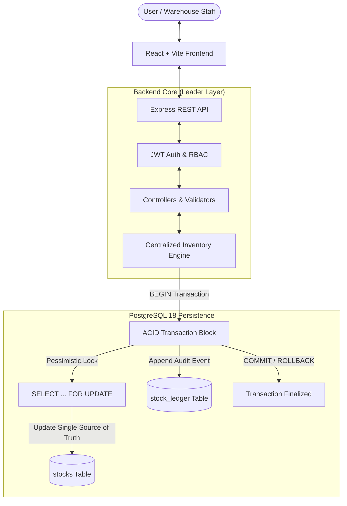

# StockSense — Enterprise Inventory Management System

**Built for the Odoo x LPU Jalandhar Hackathon 2026**


StockSense is a database-backed, production-grade Inventory Management System that digitizes and streamlines stock-related operations across multi-warehouse facilities. It replaces paper registers, isolated spreadsheets, and manual stock math with an atomic, transactional **Inventory Engine** backed by PostgreSQL.

---

## 🎯 Problem Statement & Solution

Traditional inventory workflows suffer from:
* **Manual registers and spreadsheet discrepancies** causing unrecorded shrinkage and phantom stock.
* **Lack of location-awareness**: Knowing you have 100 units is useless if you don't know which rack, aisle, or warehouse they reside in.
* **Negative stock anomalies**: Orders dispatched without available physical inventory.
* **Zero auditability**: Inability to trace who moved what stock, when, and for what reason.

### The StockSense Solution:
1. **Centralized Inventory Engine**: Single source of truth in PostgreSQL (`stocks` table) locked with `FOR UPDATE` pessimistic row locking.
2. **Atomic Operations**: Receipts (+IN), Deliveries (-OUT), Internal Transfers (Source - / Destination +), and Physical Count Adjustments executed in ACID transactions.
3. **Strict Zero-Negative-Stock**: Over-deliveries and over-transfers are rejected at the database transaction level.
4. **Immutable Stock Ledger**: Complete historical audit trail recording operator, timestamp, previous quantity, new quantity, and audit reason.
5. **Multi-Warehouse Hierarchy**: Warehouses partitioned into physical sub-locations (Main Store, Production, Quality Check, Racks).

---

## 🏗️ Architecture & Data Flow



### Invariant & Lifecycle State Machine:
```text
Draft  ──>  Ready  ──>  Done (Stock Updated + Ledger Written)
                          └──> (Idempotent: Cannot be re-applied)
```

---

## 👥 Team Roles & Responsibilities

| Member | Role | Key Owned Modules |
| :--- | :--- | :--- |
| **You (Leader)** | **Inventory Engine + Backend Core** | Database schema, connection pool, Auth API, central Inventory Engine (`increaseStock`, `decreaseStock`, `transferStock`, `setStock`), Operations APIs (Receipts, Deliveries, Transfers, Adjustments, Ledger), Automated Test Suites (`backend/test/*`). |
| **Member B** | **Frontend Shell + Dashboard** | App shell layout, sidebar & topbar, login/register UI, Live Dashboard KPIs, low-stock banner alerts, analytical breakdowns. |
| **Member C** | **Operations UI** | Product catalog CRUD, incoming Receipts workflow, customer Deliveries workflow, Internal Transfers UI, physical count Adjustments UI, Stock Ledger audit table. |
| **Member D** | **Settings, Data & Docs** | Multi-Warehouse & Location configuration UI, Categories & Partners directory, database seed script (`seed.js`), documentation (`docs/*`), demo rehearsal guide. |

---

## ⚡ Quick Start & Installation

### Prerequisites
* **Node.js**: v20 or v24
* **npm**: v10 or v11
* **PostgreSQL**: PostgreSQL 16+ running on `localhost:5433` (or `5432` configured in `.env`)

### 1. Clone & Configure Environment
```bash
git clone https://github.com/manas0306-ops/STOCK-SENSE-ODOO-x-LPU.git
cd STOCK-SENSE-ODOO-x-LPU

# Copy environment template
cp .env.example .env
cp .env.example backend/.env
```

### 2. Database Migration & Demo Data Seeding
```bash
# Install backend dependencies
cd backend
npm install

# Run initial schema migration
npm run migrate

# Seed database with demo accounts, warehouses, locations & products
npm run seed
```

### 3. Run Backend Server
```bash
# From backend directory:
npm start
# Server listens on port 5000 (http://localhost:5000)
```

### 4. Run Frontend Application
```bash
# In a separate terminal:
cd frontend
npm install
npm run dev
# Frontend runs on http://localhost:5173
```

---

## 🔐 Demo Credentials (One-Click in UI)

| Role | Email | Password | Permissions |
| :--- | :--- | :--- | :--- |
| **Inventory Manager** | `manager@stocksense.com` | `admin123` | Full Access (Catalog, Operations, Adjustments, Facilities) |
| **Warehouse Staff** | `staff@stocksense.com` | `staff123` | Operational Access (Receipts, Transfers, Deliveries) |

---

## 🧪 Comprehensive Automated Testing

StockSense includes automated test suites covering inventory math, atomic transactions, over-delivery prevention, and API contracts:

```bash
cd backend
npm test
```

### Test Results:
```text
✔ Initial setup and prerequisite checks (68ms)
✔ Receipt: Increase stock by 100 kg (53ms)
✔ Transfer: Move 20 kg to Production atomically (14ms)
✔ Transfer edge case: Same source and destination rejected (3ms)
✔ Transfer edge case: Transferring more than available rejected (4ms)
✔ Delivery: Deliver 20 kg from Production to customer (6ms)
✔ Delivery edge case: Over-delivery rejected with INSUFFICIENT_STOCK (4ms)
✔ Adjustment: Reconcile physical count (80 -> 77 kg) (16ms)
✔ Concurrency Suite: Simultaneous delivery requests with FOR UPDATE locking (50ms)
✔ Stock Ledger audit trail verification
✔ Dashboard KPIs real-time aggregation
✔ Duplicate SKU & Email uniqueness constraints
ℹ tests 35 | pass 35 | fail 0 (100% Passed)
```

### Health Audit & Demo Reset Utilities:
```bash
# Verify database integrity and zero-negative-stock constraints:
npm --prefix backend run health

# Reset test data and restore demo seed anytime:
npm --prefix backend run demo:reset
```

---

## 🎬 3-Minute Demo Walkthrough Flow

Follow this exact story to demonstrate the application to evaluators:

1. **Login**: Sign in as `manager@stocksense.com` using the one-click demo button.
2. **Dashboard**: Observe real-time KPI cards and the active low-stock banner.
3. **Receive 100 kg Steel**: Create receipt for `STL-001` into `Main Store`. Validate → Total stock becomes `100 kg`.
4. **Transfer 20 kg to Production**: Create transfer from `Main Store` to `Production`. Validate → `Main Store = 80 kg`, `Production = 20 kg`. Total company stock remains `100 kg`.
5. **Deliver 20 kg to Customer**: Dispatch `20 kg` from `Production`. Validate → `Production = 0 kg`. Attempting to ship 1 more kg is rejected (`INSUFFICIENT_STOCK`).
6. **Adjust Damaged Stock**: Reconcile count in `Main Store` from `80 kg` to `77 kg` with reason *"Rainfall damage in aisle 3"*.
7. **View Stock Ledger**: Show immutable audit timeline of every movement.
8. **Hard Refresh**: Press `Ctrl + Shift + R` — all calculations and history remain 100% consistent from PostgreSQL.

---

## 📄 License
Developed for Odoo x LPU Jalandhar Hackathon 2026. Released under the MIT License.
